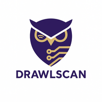

This is the DrawlScan page.

## Explore


  
  


## Documentation

DrawlScan is a CUI-based network watcher tool written in Go.
It captures packets from a specified network interface and visualizes their structure and origin using ASCII art, GeoIP, and reverse DNS lookup.

It’s like tcpdump, but with an artistic flair.

Key Features:  
    •   🎨 Visualize packet structures (Ethernet/IP/TCP/UDP/etc.) as ASCII diagrams  
    •   🌍 GeoIP-based source/destination display  
    •   🧭 Lightweight, TUI-style interface — no GUI required  
    •   🐧 Perfect for learning, demos, or simply keeping an eye on your machine  

## Usage

```bash
drawlscan [OPTION]
OPTION
    -c, --count <NUM>              Capture only a specified number of packets
    -f, --filter <REGX>            Filter packets using a BPF (Berkeley Packet Filter) expression.
                                   You can specify filters such as:
                                     - "ip src 192.168.1.1"
                                     - "ip dst 192.168.1.2"
                                     - "ip host 192.168.1.1 and ip host 192.168.1.2"
                                     - "tcp port 80"
                                     - "udp port 53"
                                     - "icmp or icmp6"
                                     - "vlan 100"
                                     - "ip host 192.168.1.1 and tcp port 80"
    -g, --geoip                    Show GeoIP information for source and destination IP addresses
    -h, --help                     Display this help message
    -i, --interface <INTERFACE>    Specify the network interface to capture packets from (e.g., eth0, wlan0)
    -o, --output <FILE>            Save the captured packets to a file in PCAP format
    -r, --read <FILE>              Read packets from a PCAP file instead of capturing live traffic
    -t, --time <TIME>              Stop capturing after a specified number of seconds
    -v, --version                  Show version information
    --no-ascii                     Disable ASCII-art output
```

## Installation

### Homebrew

```bash
🚧 under construction 🚧
```

### Compile yourself

```bash
🚧 under construction 🚧
```

## About

### Icon



### The project name(**DrawlScan**) comes from?

DrawlScan is a coined word that combines Draw (to represent packet visualization), Owl (a symbol of wisdom and observation), and Scan (for network traffic analysis)
